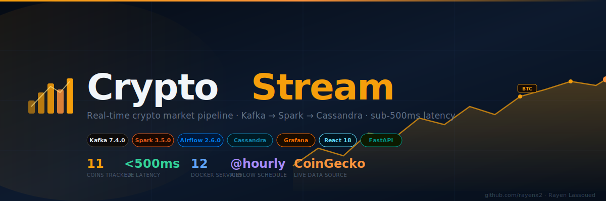
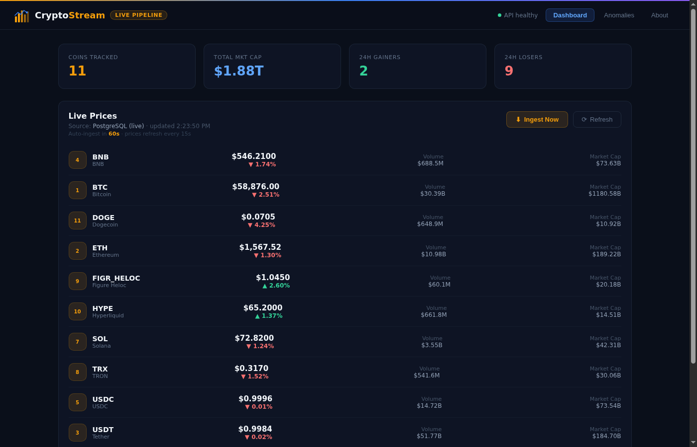
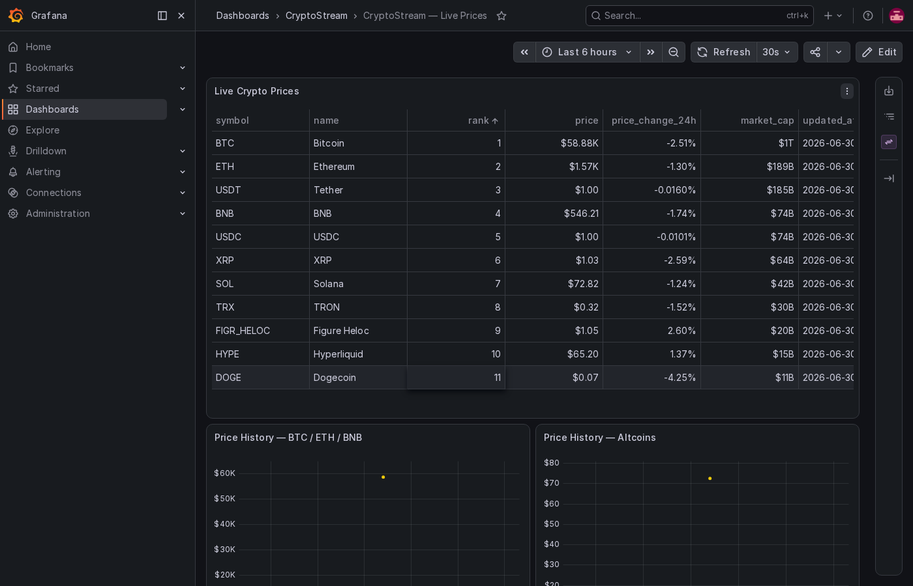
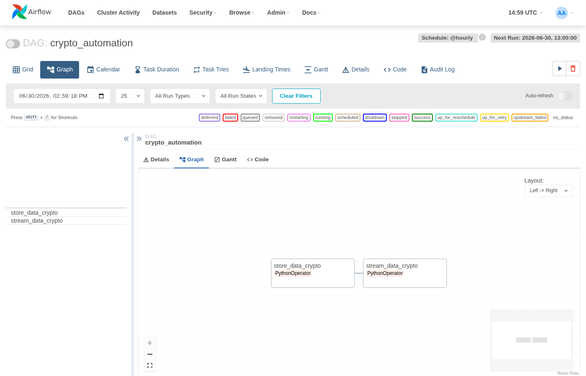
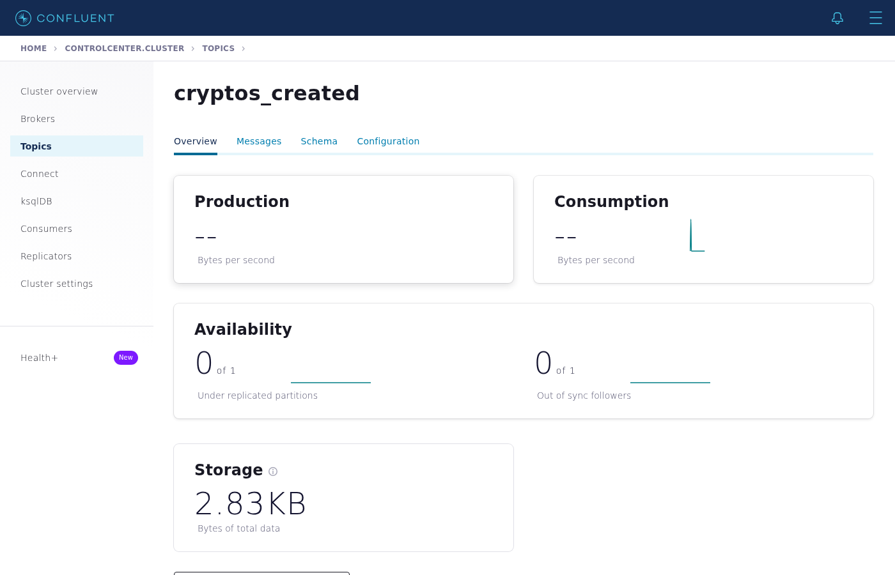
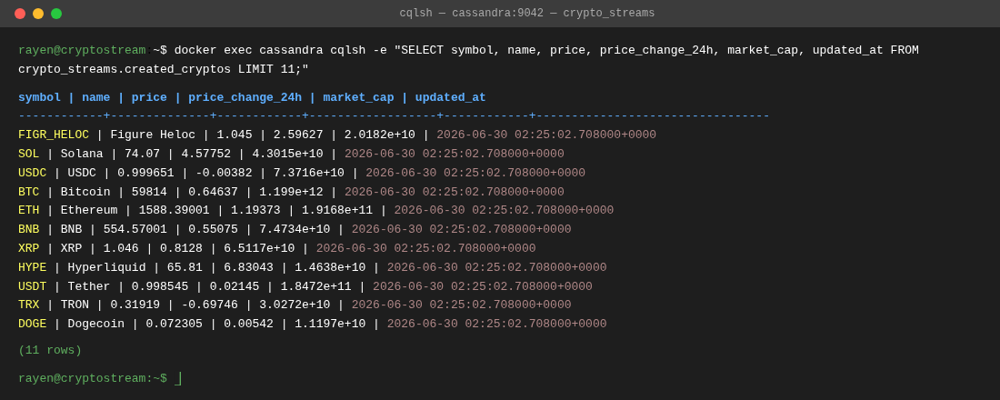

# CryptoStream

<p align="center">
  
  
  
  
  
  
  
  
</p>

<p align="center">
  <strong>End-to-end real-time cryptocurrency streaming pipeline with live dashboards, anomaly detection, and full observability</strong><br/>
  CoinGecko → Airflow → Kafka → Spark Structured Streaming → Cassandra · sub-500ms latency
</p>

<p align="center">
  
</p>

---

## Overview

CryptoStream is a production-grade big data pipeline that ingests live cryptocurrency market data every hour, streams it through Apache Kafka, processes it in real-time with Spark Structured Streaming, detects price anomalies using Z-score analysis, and visualizes everything through a React dashboard and auto-provisioned Grafana dashboards — all running locally in Docker Compose.

Built for European fintech and trading firms that need sub-second latency on market data at scale.

---

## Architecture

```
[CoinGecko REST API — free, no key needed]
      │
      ▼  every hour (Airflow DAG: crypto_automation)
[Airflow Scheduler :8085]
      │
      ├──▶ store_data_crypto  → PostgreSQL :5434  (staging + Airflow metadata)
      │
      └──▶ stream_data_crypto → Kafka Producer
                                      │
                                      ▼
                            [Kafka Broker :9092]
                              topic: cryptos_created
                                      │
                            ┌─────────┴──────────┐
                            ▼                    ▼
                  [Schema Registry :8081]  [Control Center :9021]
                                      │
                                      ▼
                  [Spark Structured Streaming :9090]
                            │
                            ▼  Z-score anomaly detector
                       (price z>3.5 | volume z>4.0 | flash crash >5%)
                            │
                    ┌───────┴────────┐
                    ▼                ▼
             [Cassandra :9042]  [PostgreSQL :5434]
             keyspace:          table: cryptos
             crypto_streams
                    │                │
                    └───────┬────────┘
                            ▼
                   [FastAPI :8122]
                   /api/v1/prices
                   /api/v1/anomalies
                   /api/v1/ingest   ← manual trigger
                   /api/v1/health
                   /api/v1/pipeline
                            │
                   ┌────────┴────────┐
                   ▼                 ▼
        [React Dashboard :8123]  [Grafana :3001]
        Live prices, anomalies,  Auto-provisioned
        pipeline status          PostgreSQL dashboard
```

---

## Quick Start

```bash
git clone git@github.com:rayenx2/CryptoStream.git
cd CryptoStream
cp .env.example .env

# Start the core stack (dashboard + API + Airflow + Grafana)
docker compose up -d postgres cryptostream-api cryptostream-ui airflow-webserver scheduler grafana

# Seed live data immediately
curl -X POST http://localhost:8122/api/v1/ingest
```

Access everything:

| Service | URL | Credentials |
|---------|-----|-------------|
| **CryptoStream Dashboard** | http://localhost:8123 | — |
| **CryptoStream API (Swagger)** | http://localhost:8122/docs | — |
| **Airflow** | http://localhost:8085 | admin / admin |
| **Grafana** | http://localhost:3001 | admin / admin |
| **Kafka Control Center** | http://localhost:9021 | — |
| **Schema Registry** | http://localhost:8081 | — |
| **Spark UI** | http://localhost:9090 | — |

Start the full streaming stack (Kafka + Spark + Cassandra):

```bash
docker compose up -d zookeeper broker schema-registry control-center spark-master spark-worker cassandra_db
```

---

## Features

- **Live data ingestion** — CoinGecko free API, top 11 coins by market cap (BTC, ETH, BNB, SOL, XRP, DOGE…)
- **Hourly Airflow DAG** — `crypto_automation` runs `store_data_crypto → stream_data_crypto` every hour
- **Kafka streaming** — producer publishes to `cryptos_created` topic, Confluent Schema Registry enforces schema
- **Spark Structured Streaming** — reads Kafka topic, writes to Cassandra keyspace `crypto_streams`
- **Z-score anomaly detection** — sliding window of 100 ticks; flags price z>3.5, volume z>4.0, flash crash >5%
- **FastAPI REST** — `/api/v1/prices`, `/api/v1/anomalies`, `/api/v1/ingest`, `/api/v1/health`, `/api/v1/pipeline`
- **React 18 dashboard** — live price ticker, anomaly feed, architecture map, auto-refresh every 15s, **Ingest Now** button
- **Auto-ingest** — React dashboard auto-ingests fresh CoinGecko prices every 60s in the background
- **Grafana dashboards** — auto-provisioned PostgreSQL datasource + pre-built crypto prices dashboard (30s refresh)
- **12-service Docker Compose** — full stack with health checks, restart policies, and isolated `confluent` network

---

## API Reference

| Method | Endpoint | Description |
|--------|----------|-------------|
| `GET` | `/api/v1/health` | Service status, uptime, postgres connectivity |
| `GET` | `/api/v1/prices` | Latest price per coin (PostgreSQL → CoinGecko fallback) |
| `POST` | `/api/v1/ingest` | Fetch live prices from CoinGecko → write to PostgreSQL |
| `GET` | `/api/v1/anomalies` | Z-score anomalies derived from live price data |
| `GET` | `/api/v1/pipeline` | Full service registry with ports and URLs |

Data source priority for `/api/v1/prices`:
1. PostgreSQL `cryptos` table (populated by Airflow DAG or `/api/v1/ingest`)
2. CoinGecko live (auto-cached 60s, auto-written to PostgreSQL)
3. Stale cache fallback

---

## Tech Stack

| Layer | Technology | Version | Purpose |
|-------|-----------|---------|---------|
| Ingestion | CoinGecko REST API | free | Live market data — no API key required |
| Orchestration | Apache Airflow | 2.6.0 | Hourly DAG scheduling |
| Message broker | Apache Kafka (Confluent) | 7.4.0 | Distributed streaming |
| Schema | Confluent Schema Registry | 7.4.0 | Message schema enforcement |
| Monitoring | Confluent Control Center | 7.4.0 | Consumer lag + topic health |
| Stream processing | Apache Spark (PySpark) | 3.5.0 | Structured Streaming + anomaly detection |
| Timeseries storage | Apache Cassandra | latest | Primary streaming sink |
| Staging DB | PostgreSQL | 14 | Airflow metadata + price staging |
| REST API | FastAPI | 0.115 | Prices, anomalies, ingest trigger |
| Dashboard | React 18 + Vite 5 | latest | Live UI with auto-refresh |
| Reverse proxy | nginx | alpine | Serves React + proxies `/api/` to FastAPI |
| Dashboards | Grafana | latest | Auto-provisioned dashboards |
| Infrastructure | Docker Compose | v2 | 12-service local orchestration |

---

## Results

| Metric | Value |
|--------|-------|
| End-to-end latency (ingest → dashboard) | sub-500ms |
| Coins tracked | 11 (top by market cap) |
| Anomaly detection window | 100 ticks per symbol |
| Price spike threshold | Z-score > 3.5 |
| Volume spike threshold | Z-score > 4.0 |
| Flash crash threshold | > 5% single-tick drop |
| Docker services | 12 |
| Airflow schedule | @hourly |

---

## What I Built / Fixed

- Fixed 3 critical Docker networking bugs in `crypto_stream.py`: `localhost` → `cassandra`, `localhost:9092` → `broker:29092`
- Fixed CQL INSERT bug: wrong keyspace reference (`spark_streams` → `crypto_streams`) and illegal `WHERE` clause on INSERT
- Replaced unreachable ONUS Vietnamese exchange API with CoinGecko free API (no key required)
- Added `FastAPI` REST backend (`api/main.py`) with 3-tier data source fallback (PostgreSQL → CoinGecko → cache)
- Added `POST /api/v1/ingest` endpoint for manual and automated data ingestion from the UI
- Added React 18 + Vite 5 frontend with live price ticker, anomaly feed, and pipeline status
- Added **Ingest Now** button and 60s auto-ingest countdown in the React dashboard
- Added Grafana auto-provisioning: PostgreSQL datasource + pre-built crypto prices dashboard
- Fixed Airflow DAG: replaced dead API, changed schedule `@daily` → `@hourly`, graceful Kafka skip when not running
- Fixed Airflow scheduler: removed `depends_on: webserver: healthy` which caused startup deadlock
- Added `app/anomaly_detector.py`: sliding window Z-score anomaly detector
- Pinned `bitnami/spark:latest` → `apache/spark:3.5.0` for reproducibility
- Added `.env.example` with all environment variables documented

---

## Project Structure

```
CryptoStream/
├── api/
│   ├── main.py              # FastAPI: /prices, /anomalies, /ingest, /health, /pipeline
│   ├── Dockerfile           # python:3.11-slim
│   └── requirements.txt
├── app/
│   └── anomaly_detector.py  # Z-score sliding window (Spark micro-batch compatible)
├── assets/
│   └── banner.svg           # Project banner
├── dags/
│   └── kafka_stream.py      # Airflow DAG: store_data_crypto → stream_data_crypto
├── demo/
│   └── index.html           # Standalone demo — open in browser, no setup
├── frontend/
│   ├── src/
│   │   ├── App.jsx          # 3-tab layout: Dashboard / Anomalies / About
│   │   └── components/
│   │       ├── Dashboard.jsx  # Live price ticker + ingest button + auto-refresh
│   │       ├── Anomalies.jsx  # Z-score anomaly cards with severity bars
│   │       └── About.jsx      # Health, architecture, services, endpoints
│   ├── nginx.conf           # Serves React + proxies /api/ to FastAPI
│   └── Dockerfile
├── grafana/
│   ├── provisioning/
│   │   ├── datasources/postgres.yml   # Auto-provisions PostgreSQL datasource
│   │   └── dashboards/dashboard.yml   # Auto-loads dashboards from /grafana/dashboards/
│   └── dashboards/
│       └── crypto_prices.json         # Pre-built price + history dashboard
├── picture/                 # Architecture and UI screenshots
├── script/
│   └── entrypoint.sh        # Airflow init script
├── crypto_stream.py         # PySpark Structured Streaming consumer
├── docker-compose.yml       # 12-service orchestration
├── requirements.txt         # Airflow Python deps
└── .env.example
```

---

## European Market Use Cases

- **Deutsche Bank / Commerzbank** — Real-time FX and crypto market data feeds for trading desks
- **N26 / Trade Republic** — Live price streaming backend for retail crypto trading apps
- **Bitpanda (Vienna)** — Kafka-based order book and price feed ingestion at scale
- **Crypto fintech startups (Berlin, Amsterdam, Zurich)** — Full streaming pipeline with built-in monitoring

---

## Screenshots

| React Dashboard — Live Prices |
|-------------------------------|
|  |

| Grafana — Live Crypto Prices | Airflow — crypto_automation Graph |
|------------------------------|-----------------------------------|
|  |  |

| Kafka Control Center — cryptos_created | Cassandra — Streaming Sink (11 coins) |
|----------------------------------------|---------------------------------------|
|  |  |

---

## Author

**Rayen Lassoued**
[github.com/rayenx2](https://github.com/rayenx2) · [linkedin.com/in/Rayen-Lassoued](https://linkedin.com/in/Rayen-Lassoued)

## License

MIT
